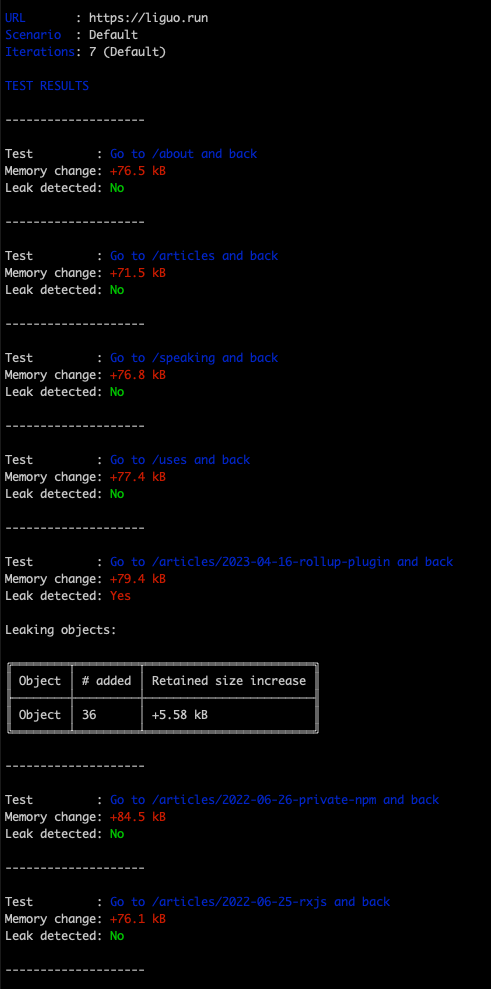
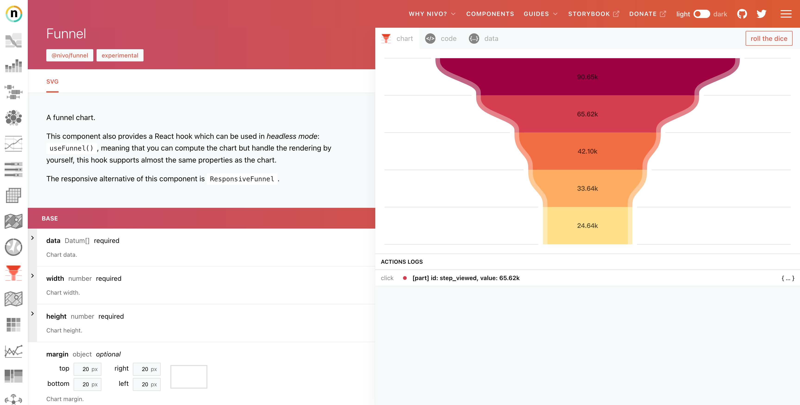
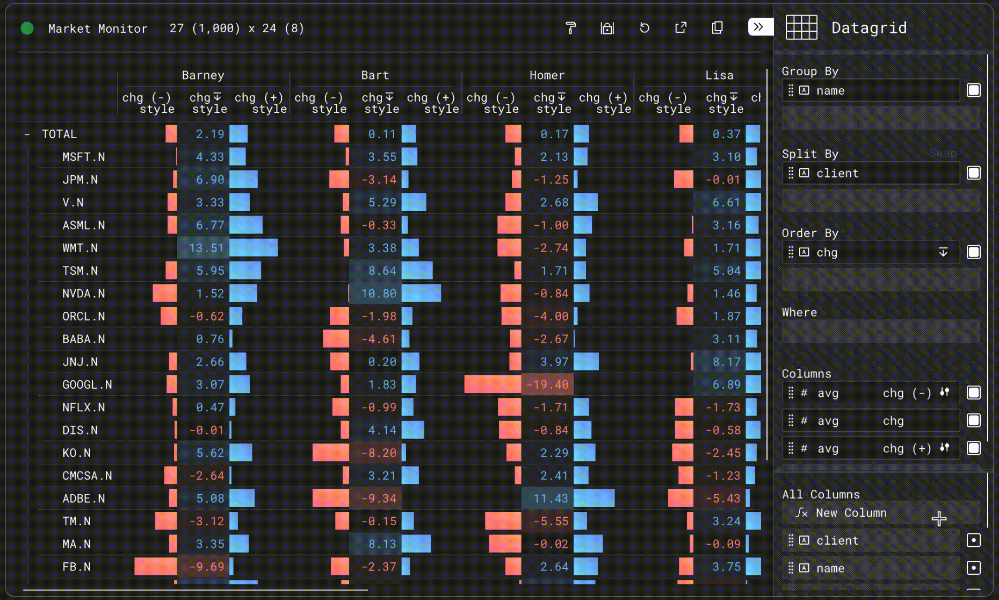
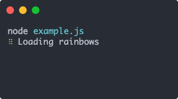
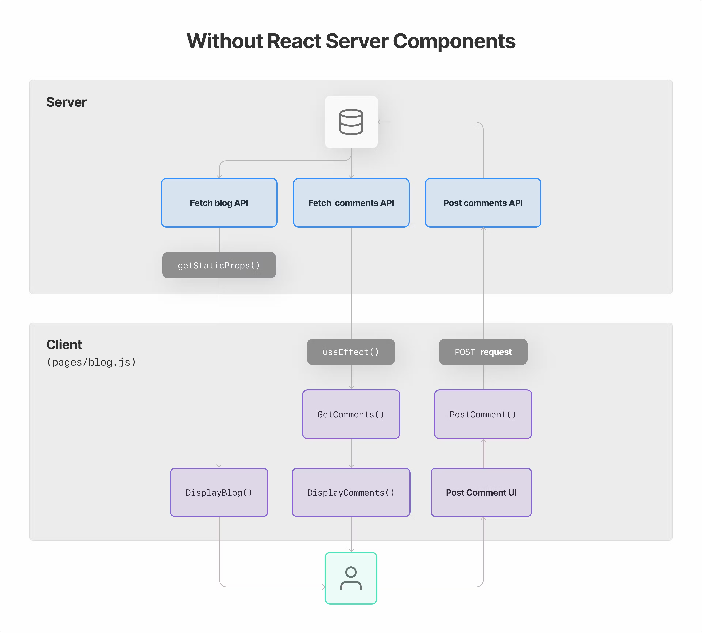
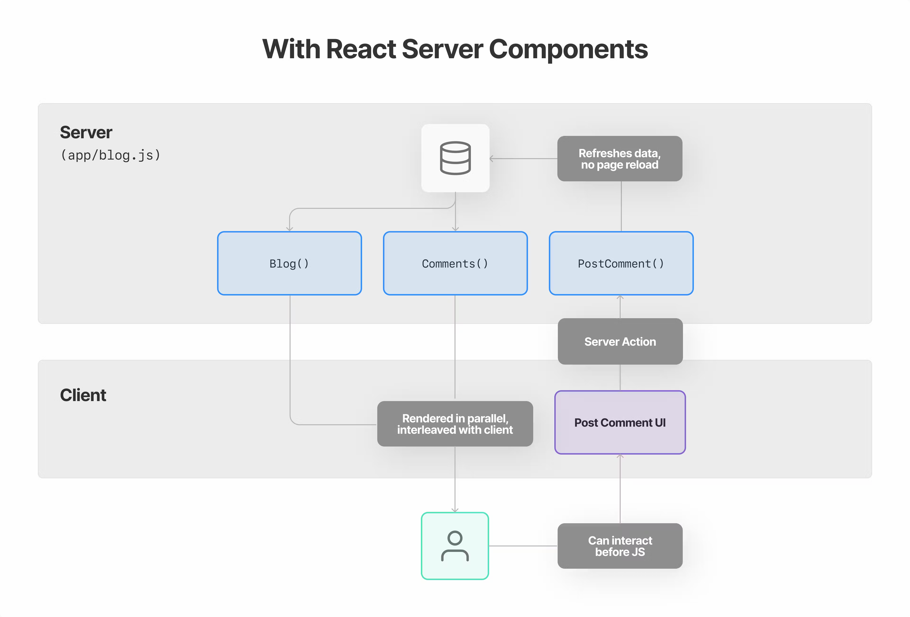
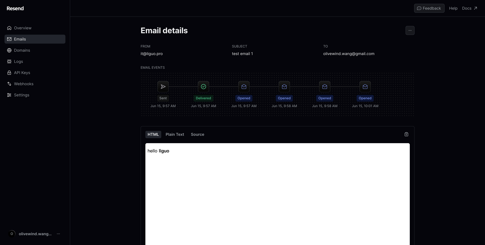
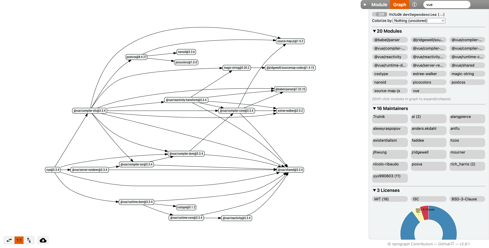

**项目地址**：[olivewind/weekly](https://github.com/olivewind/weekly)

**微信公众号**：[依赖注入](https://mp.weixin.qq.com/s/k8bm24JFz1BcSsjLtX4H0A)

**发布时间**：2023.08.13

**本周内容**：动态x1、开源x14、文章x3、工具x3

***

## 动态

### [# TypeScript 5.2 进入 RC 阶段](https://devblogs.microsoft.com/typescript/announcing-typescript-5-2-rc/)

1. `using` 声明和显式资源管理，这是 [Explicit Resource Management](https://github.com/tc39/proposal-explicit-resource-management) 提案的实现；
2. 装饰器元数据，这是 [Decorator Metadata](https://github.com/tc39/proposal-decorator-metadata) 提案的实现；
3. 元组类型标签的全有或全无限制被取消；
4. 简化联合数组类型的方法调用；
5. `import type` 支持 `.ts`、`.mts`、`.cts` 和 `.tsx` 文件扩展名；
6. 对象成员的逗号自动补全。

## 开源

### [fuite](https://github.com/nolanlawson/fuite)（3.6k star）

fuite 是一个基于 Puppeteer 实现的内存泄漏排查工具，其用法非常简单：
```shell
fuite https://liguo.run
```

默认情况下fuite 会尝试打开每个链接并返回，反复如此来检测应用内存是否泄露，当然你可以完全自定义这个执行逻辑。最终你会得到类似这样的一个性能泄漏检测报告：


### [Luxon](https://github.com/moment/luxon)（14.1k star）
Luxon 是一个用于在 JavaScript 中处理日期和时间的库，其主要优点是使用浏览器原生的 zone 和 intl 支持，因此不需要 locale 或 tz 文件。

```javascript
DateTime.now()
  .setZone("America/New_York")
  .minus({ weeks: 1 })
  .endOf("day")
  .toISO();
```

### [filesize.js](https://github.com/avoidwork/filesize.js)（1.4k star）

filesize.js 提供了一种将数字或字符串转化成人类可读的文件大小字符串的方法。
```javascript
import { filesize } from "filesize";

filesize(265318, { base: 2, standard: "jedec" }); 

// "259.1 KB"
```


### [Dexie.js](https://github.com/dexie/Dexie.js)（9.5k star）

Dexie.js 是 indexedDB（浏览器中的标准数据库）的包装库，被广泛使用在 WhatsApp、Github Desktop、Microsoft To Do 等应用，其解决了原生 indexedDB 的三个问题：

* 不明确的错误处理
* 糟糕的查询方法
* 代码复杂度较高
`
```javascript
// 定义数据库
const db = new Dexie('MyDatabase');

db.version(1)
  .stores({ friends: '++id, name, age' });

// 插入数据
await db.friends.add({ 
  name: 'Camilla', 
  age: 25
});

// 查询数据
await db.friends
  .where("age")
  .between(18, 65)
  .toArray();
```

### [rxdb](https://github.com/pubkey/rxdb)（19.5k star）

RxDB（Reactive Database）是一个离线优先的 NoSQL 数据库，适用于 JavaScript 应用。响应式意味着你不仅可以查询当前状态，还可以订阅所有状态更改，例如查询结果甚至文档的单个字段。这对于基于 UI 的实时应用程序来说非常有用，不仅可以轻松开发，还具有巨大的性能优势。`

```javascript
import { createRxDatabase} from 'rxdb';
import { getRxStorageDexie } from 'rxdb/plugins/storage-dexie';

// 创建数据库
const db = await createRxDatabase({
    name: 'heroesdb',
    // dexie.js 是 IndexedDB 的轻量级封装
    storage: getRxStorageDexie()
});

// 添加定义
await db.addCollections({
  heroes: {
    schema: mySchema
  }
});

// 插入数据
await db.heroes.insert({
  name: 'Bob',
  healthpoints: 100
});


// 消费数据方式一：查询一次
const aliveHeroes = await db.heroes.find({
  selector: {
    healthpoints: {
      $gt: 0
    }
  }
}).exec(); // the exec() returns the result once

// 消费数据方式二：持续订阅
await db.heroes.find({
  selector: {
    healthpoints: {
      $gt: 0
    }
  }
})
.$
.subscribe(aliveHeroes => console.dir(aliveHeroes));
```


### [nivo](https://github.com/plouc/nivo)（11.7k star）

nivo 是一个基于 d3 和 React 库构建的数据可视化组件库，其主要特点有：
1. 支持过渡动画
2. 支持多主题适配
3. 支持响应式图表
4. 支持服务端渲染
5. 支持 HTML、SVG、Canvas 多种模式图表



### [perspective](https://github.com/finos/perspective)（6.6k star）

Perspective 是一个交互式分析和数据可视化组件，特别适合大型数据集。




### [langui](https://github.com/ahmadbilaldev/langui)（955 star）

一个专为 AI LLM 应用构建的 Tailwind 组件集合，拥有超过 60 个响应式且支持暗黑模式的组件。


### [react-image-gallery](https://github.com/xiaolin/react-image-gallery)（3.5k star）

一个支持缩略图的 React 轮播图片库组件。


### [ora](https://github.com/sindresorhus/ora)（8.6k star）

一个优雅的 Node.JS 命令行 Loading 库，在实现 CLI 时很有用。


### [tsup](https://github.com/egoist/tsup)（6.3k star）

一个基于 esbuild 实现的开箱即用的 TypeScript 打包工具，内置支持 tsx、cs 等文件类型。
```shell
tsup src/index.ts src/cli.ts
```

```javascript
import { defineConfig } from 'tsup'

export default defineConfig({
  entry: ['src/index.ts'],
  splitting: false,
  sourcemap: true,
  clean: true,
});
```


### [express-rate-limit](https://github.com/express-rate-limit/express-rate-limit)（2.5k star）

一个 Express 的限速中间件，用于限制对公共 API 或端点的重复请求，例如密码重置。

```javascript
import rateLimit from 'express-rate-limit';

const limiter = rateLimit({
	windowMs: 15 * 60 * 1000, // 时间窗口 15 分钟
	max: 5, // 每个 IP 在每个时间窗口内只能请求 5 次
	message: async (request, response) => {
		return '操作过于频繁，请稍后再试'
	},
})

app.use(limiter)
```

### [express-slow-down](https://github.com/express-rate-limit/express-slow-down)（205 star）

一个 Express 的限速中间件，和上面介绍的 express-rate-limit 区别是，只减慢响应速度而不是阻止响应，别看这个库 star 少，npm 包的下载量倒是很高。

```javascript
const slowDown = require("express-slow-down");

app.enable("trust proxy"); // only if you're behind a reverse proxy (Heroku, Bluemix, AWS if you use an ELB, custom Nginx setup, etc)

const speedLimiter = slowDown({
  windowMs: 15 * 60 * 1000, // 时间窗口 15 分钟
  delayAfter: 5, // 每个 IP 在每个时间窗口内只能请求 5 次，超过部分开始减慢响应速度
  delayMs: 500 // 响应速度减慢 500 毫秒
});

app.use(speedLimiter);
```

### [eslint-config-prettier](https://github.com/prettier/eslint-config-prettier)（4.8k star）

用于关闭 ESLint 中所有和 Prettier 冲突的规则，很实用。

## 文章

### [因为 React 你忘记了的事情（英文）](https://joshcollinsworth.com/blog/antiquated-react)

React 是新的 IBM：你应该学习它，你应该了解它的缺点，你可能仍然应该在正确的环境中部署它。 你永远不会因为选择它而被解雇，但它会很昂贵、臃肿、难以正确实施，而且每一步的实施都会毫无乐趣。从现在开始，你应该去探索过去这段时间你所错过的可能性，包括 Svelte、Astro、Qwik，Web Component...


### [理解 React Server Component（英文）](https://vercel.com/blog/understanding-react-server-components)

了解 React Server Comonent 的基础知识，以更好地理解为什么（以及何时）采用它，本文由 Vercel 团队编写，值得一读。





### [加速 V8 堆快照（英文）](https://v8.dev/blog/speeding-up-v8-heap-snapshots)

 Bloomberg（彭博社）工程师在解决内存泄漏过程中希望可以在应用生命周期的不同时刻捕获多个堆快照，但是每个全尺寸快照需要花费 30 多分钟，这使得内存泄漏问题的排查进展缓慢。这篇文章介绍了他们是如何一步步解决该问题，使 JavaScript 内存分析比以往更快，包括散列冲突和缓存优化等问题。
 

## 工具

### [Clerk](https://clerk.com/)
Clerk 是一个支持和 Next.js 无缝集成的访问控制 SaaS 服务，可以非常轻松集成 Google、Facebook、Apple、Github、Twritter、TikTok 等社交媒体账号。整体体验非常赞，可以节省大量用于访问控制上的开发时间。
```jsx
import { SignIn } from "@clerk/nextjs";

const SignInPage = () => (
  <SignIn path="/sign-in" routing="path" signUpUrl="/sign-up" />
);

export default SignInPage;
```


### [Resend](https://resend.com/)

Resend 是一个面向开发人员的一站式电子邮件管理 SaaS 服务，具备以下主要特性：
1. 追踪邮件打开（email open）事件
2. 追踪链接点击（link click）事件
3. 可视化邮件链路（发送、送达、打开、点击等）
4. 支持直接用 React 编写邮件模板
5. 支持 Webhooks、团队管理、日志记录、域名绑定等
```typescript
import { EmailTemplate } from '../../components/EmailTemplate';
import { Resend } from 'resend';

const resend = new Resend(process.env.RESEND_API_KEY);

export async function sendEmail() {
	const data = await resend.emails.send({
	  from: 'Acme <onboarding@resend.dev>',
	  to: ['delivered@resend.dev'],
	  subject: 'Hello world',
	  react: EmailTemplate({ firstName: 'John' }),
	});
};
```



值得一提的是，其追踪邮件打开事件的方式是在每封邮件中插入 1x1 像素透明 GIF 图像，打开邮件时图片触发下载，此过程被标记为一次 email open 事件。
### [npmgraph](https://npmgraph.js.org/)

一个用于可视化显示 npm 包依赖图谱的工具。

